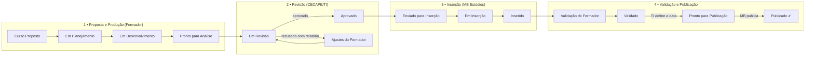

# AutoriaSCS • Gestão de Cursos
## Apresentação do funcionamento do sistema — Direção CECAPE

**CECAPE / Secretaria de Educação de São Caetano do Sul**
Sistema de acompanhamento da produção de cursos da Plataforma AutoriaSCS

---

## 1. O problema que o sistema resolve

A produção de um curso para a Plataforma AutoriaSCS envolve três equipes — o(a)
**formador(a)** que cria o conteúdo, o **CECAPE/TI** que revisa, e a **MB Estúdios**
que insere e publica na plataforma. Sem uma ferramenta única, o acompanhamento
dependia de e-mails e planilhas: não havia visão do todo, os materiais chegavam fora
de ordem e não ficava registrado quem fez o quê.

O sistema coloca **todo o ciclo em um quadro único (Scrum/Kanban)**, com regras
automáticas: cada perfil só faz o que lhe cabe, na ordem certa, e cada passo gera
aviso por e-mail e registro de auditoria.

## 2. Quem participa

| Perfil | Responsabilidade |
|---|---|
| **Professor(a)/Formador(a)** | Propõe o curso, produz e envia os materiais na ordem padronizada, valida o curso inserido |
| **CECAPE/TI** | Revisa (técnica e pedagogicamente), aprova ou devolve com apontamentos, agenda a publicação |
| **MB Estúdios** | Baixa os materiais (pacote único, já ordenado), insere na plataforma e publica |
| **Administrador** | Configura o fluxo, usuários, perfis de acesso e acompanha a auditoria |

## 3. O fluxo do curso, do início ao fim

**Pontos de controle do fluxo:**

1. **Cada seta é uma permissão.** O sistema só permite a movimentação ao perfil
   responsável por ela — um formador não "pula" a revisão, a MB não publica sem a
   data agendada pela TI.
2. **Recusa com relatório.** Quando a TI recusa, registra apontamentos tipificados
   (técnico, pedagógico, ABNT); o formador corrige e devolve. Nada se perde em e-mails.
3. **Data de publicação.** Ao concluir a validação, a TI informa a data de entrada na
   plataforma — comunicada automaticamente ao formador e à MB.
4. **E-mail automático em toda transição.** Quem precisa agir na próxima etapa é
   avisado na hora (além de alertas diários de prazo e resumo semanal às segundas).

## 4. Entrega padronizada dos materiais

O maior ganho operacional: os materiais são enviados **na ordem exata em que a MB
insere o conteúdo na plataforma** — o sistema trava a etapa seguinte até a anterior
ser concluída.

- **Módulo Geral:** Apresentação do(s) Formador(es) → Apresentação do Curso →
  Objetivos → Atividade Avaliativa Geral → Referência Bibliográfica
- **Cada Módulo (1 a 8):** Apresentação do Módulo → Slide → Vídeo → Anexo →
  Texto Complementar → Atividade Avaliativa

Itens opcionais podem ser declarados "sem material" (fica registrado quem declarou e
quando). A MB baixa **tudo em um único pacote ZIP**, já organizado em pastas numeradas
na ordem de inserção — sem risco de material faltando ou fora de sequência.

## 5. Governança e transparência

- **Auditoria completa** — cada ação registra quem fez, o quê, quando, valores
  antes/depois e o endereço IP. Exportável em CSV;
- **Relatórios gerenciais** — cursos por status, por formador, prazos estourados;
- **Perfis de acesso configuráveis** — a direção pode criar novos papéis (ex.:
  coordenação com acesso somente-leitura) sem alterar o sistema;
- **Fluxo configurável** — colunas, status e permissões são ajustáveis pela
  administração, sem depender de programação;
- **Biblioteca de modelos** — templates oficiais versionados, garantindo que todos os
  formadores usem o material vigente.

## 6. Resultados esperados para a gestão

| Antes | Com o sistema |
|---|---|
| Acompanhamento por e-mail/planilha | Quadro Kanban único, em tempo real |
| Materiais fora de ordem ou faltando | Sequência obrigatória + pacote ZIP ordenado |
| Revisões sem histórico | Apontamentos tipificados e rastreáveis |
| "Quem alterou isso?" | Auditoria completa de todas as ações |
| Prazos esquecidos | Alertas automáticos diários + resumo semanal |
| Comunicação manual entre equipes | E-mail automático a cada passagem de etapa |

## 7. Acesso

- **Endereço:** `https://cecapescs.com.br/autoriascs/scrum/`
- **Suporte:** ti.cecape@scseduca.com.br
- Tutoriais por perfil disponíveis em `docs/tutoriais/`
  (Professor/Formador, TI, MB Estúdios e Administrador), com imagens das telas.
