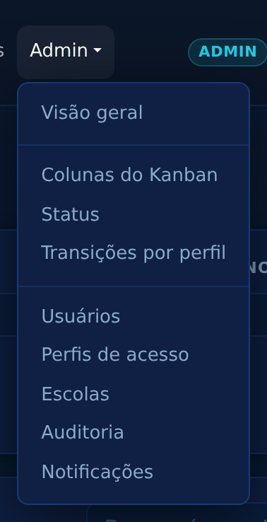
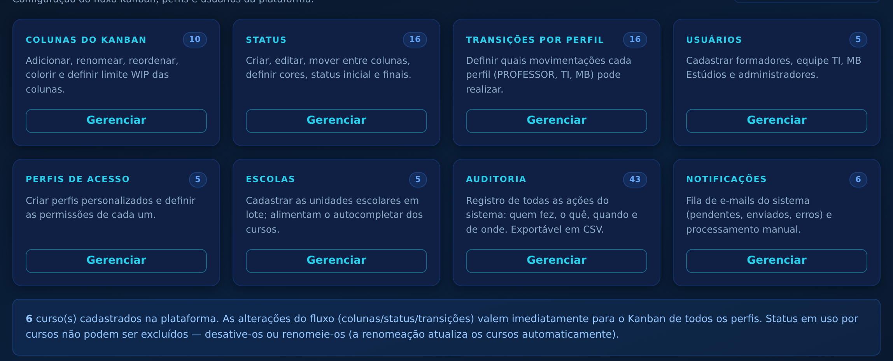
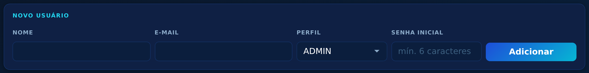
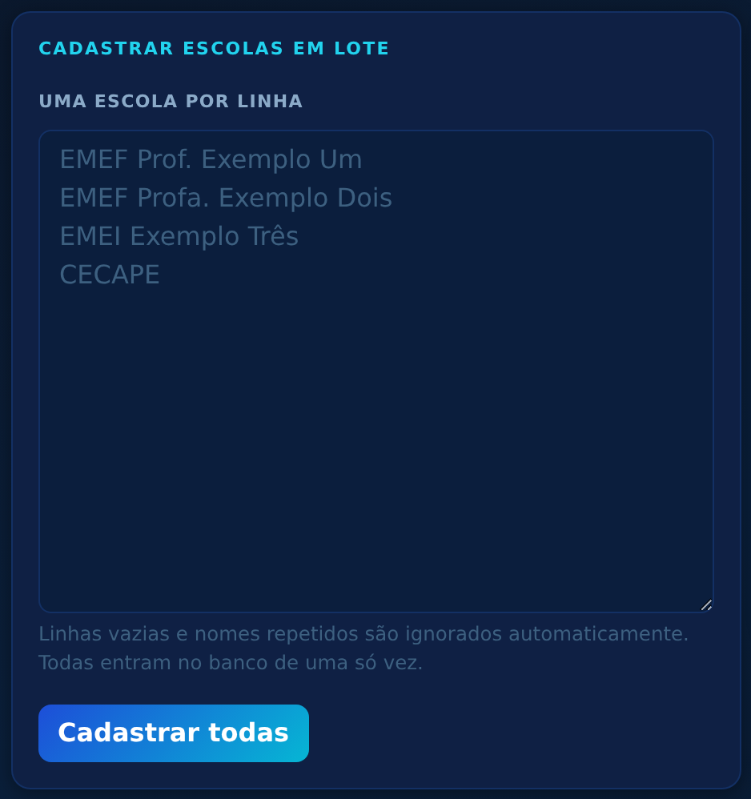
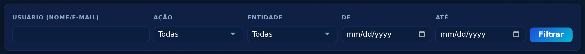
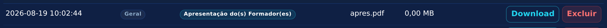

# Tutorial — Administrador(a)

Guia da área administrativa do **AutoriaSCS • Gestão de Cursos**. O perfil ADMIN tem
todos os poderes dos demais perfis e, além disso, configura o próprio fluxo do sistema.

> Endereço: `https://cecapescs.com.br/autoriascs/scrum/` • Suporte: **ti.cecape@scseduca.com.br**

---

## 1. Menu Admin

Tudo fica no menu **Admin** do topo:

A **Visão geral** resume cada área com contadores e atalhos:

## 2. Fluxo Kanban configurável

O fluxo **não é fixo no código** — é montado nestas três telas, e as mudanças valem
imediatamente para todos os perfis:

- **Colunas do Kanban** — criar, renomear, reordenar, colorir, definir limite WIP e
  ativar/desativar colunas;
- **Status** — criar/editar status, mover entre colunas, definir cor do badge, status
  inicial (novos cursos) e finais. Renomear um status atualiza automaticamente todos os
  cursos e o histórico; excluir só é possível sem cursos no status;
- **Transições por perfil** — define quem pode mover o quê (ex.: PROFESSOR:
  Em Planejamento → Em Desenvolvimento). O ADMIN pode todas as movimentações.

> Se as transições forem alteradas por engano, o script `database/reset_transicoes.sql`
> restaura o fluxo oficial.

## 3. Usuários

Cadastro de formadores, TI, MB e administradores — com perfil, ativação e redefinição
de senha. O campo de busca tem autocompletar com os nomes do banco:

## 4. Perfis de acesso

Em **Perfis de acesso** é possível criar perfis personalizados (ex.: COORDENADOR) e
marcar as permissões de cada um: administração total, ver todos os cursos, propor
cursos, mover o Kanban, revisar, gerenciar modelos e receber e-mails de revisão/inserção.
O perfil ADMIN é protegido contra alterações que travariam o sistema.

## 5. Escolas (cadastro em lote)

Cole a lista de escolas na caixa de texto — **uma por linha** — e cadastre todas de uma
vez. Nomes repetidos são ignorados automaticamente. As escolas alimentam o
autocompletar dos formulários de curso e dos filtros:

Também é possível renomear (atualiza os cursos vinculados), desativar e excluir.

## 6. Auditoria

Toda ação fica registrada: quem fez, o quê, quando, valores antes/depois e IP —
inclusive logins, downloads, exclusões e registros "sem material". Filtre por usuário,
ação, entidade e período, e exporte em CSV:

## 7. Notificações

Monitor da fila de e-mails (pendentes, enviados, erros) com processamento manual.
Os e-mails saem em tempo real; o cron de 5 minutos reenvia os que falharem
(`cron/cron_notificacoes.php`), e o cron diário das 7h envia alertas de prazo e o
resumo semanal (`cron/cron_prazos.php`).

## 8. Excluir arquivos enviados

Somente o ADMIN pode excluir um arquivo enviado por engano pelo formador — botão
**Excluir** na lista de arquivos do curso, com confirmação:

A exclusão remove o arquivo do servidor, fica na auditoria e **recalcula a sequência
de entregas** do módulo (a categoria volta a ser a pendente do formador).

## 9. Boas práticas

- Faça **backup do banco** antes de rodar qualquer migração (`database/upgrade_v*.sql`);
- Troque a senha padrão do usuário inicial e revise usuários inativos periodicamente;
- Não edite status/transições em produção sem conferir o fluxo com a equipe —
  a auditoria registra, mas a mudança vale na hora.
