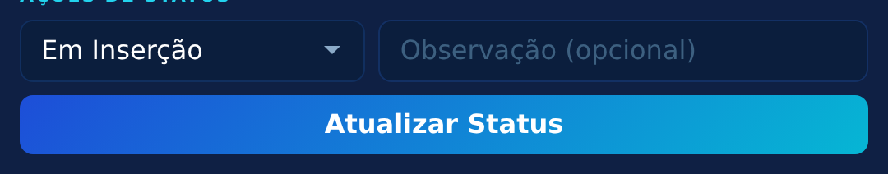
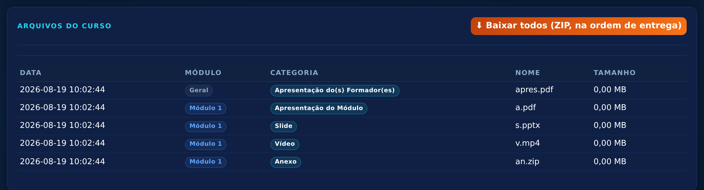
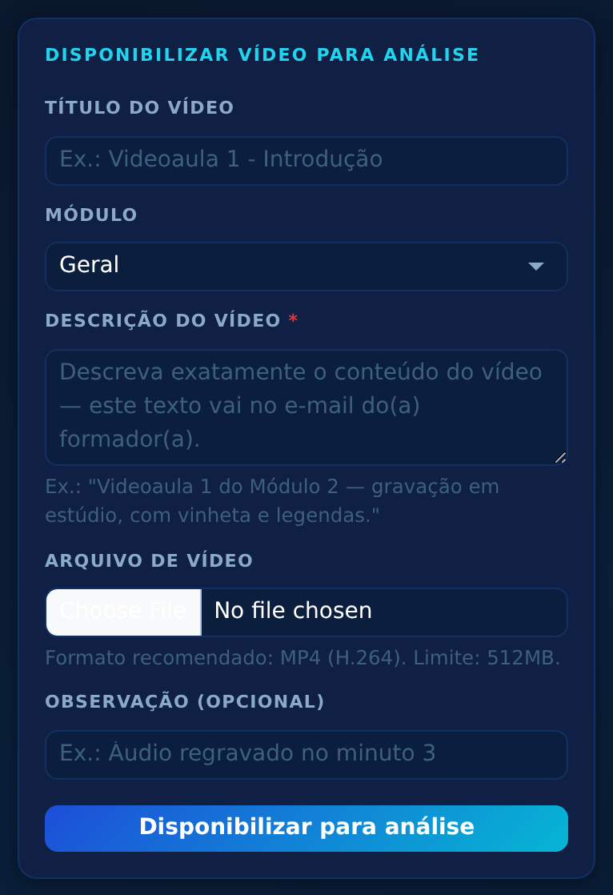
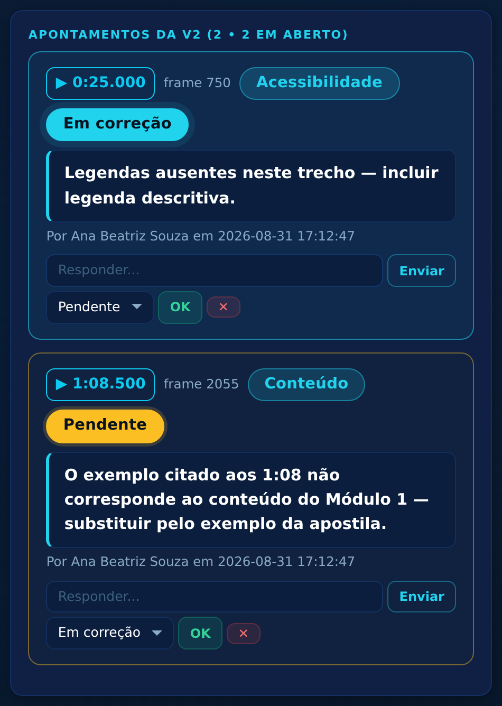

# Tutorial Completo — MB Estúdios

**Sistema AutoriaSCS • Gestão de Cursos** — guia passo a passo da equipe da MB
Estúdios, escrito para quem está começando no sistema.

> **Endereço:** `https://cecapescs.com.br/autoriascs/scrum/`
> **Suporte:** ti.cecape@scseduca.com.br

---

## 1. Entrar no sistema

1. Abra o navegador (Chrome, Edge ou Firefox);
2. Acesse `cecapescs.com.br/autoriascs/scrum`;
3. Digite o **e-mail** e a **senha** fornecidos pelo CECAPE e clique em **Entrar**.

A sessão dura 8 horas e se renova a cada clique. Para sair, use o botão **Sair**
no canto superior direito.

## 2. O papel da MB no fluxo

Além da inserção e da publicação, a MB é responsável por **produzir os vídeos das
videoaulas** e submetê-los à análise do(a) formador(a) (seção 6 deste guia).

No fluxo do curso, a MB entra em cena **duas vezes**:

**Antes disso — o projeto aprovado.** Quando a TI aprova o projeto de um curso novo,
a MB recebe um e-mail com a **identificação oficial**, no formato
*Nome do curso - Nome do(a) formador(a) - Carga horária*. **Use exatamente esse nome na
pasta do curso** — ele também dá nome ao pacote ZIP dos materiais.

**Momento 1 — Inserção.** A TI aprova o curso e move para **Enviado para
Inserção** → a MB recebe um e-mail. A MB então baixa os materiais, monta o curso
na Plataforma AutoriaSCS e registra o avanço no sistema.

**Momento 2 — Publicação.** Depois que o formador valida o curso montado e a TI
agenda a data (**Pronto para Publicação**), a MB recebe novo e-mail com a data de
entrada. No dia, publica o curso na plataforma e marca **Publicado** no sistema.

**Todas as movimentações da MB:**

| De | Para | Significado |
|---|---|---|
| Enviado para Inserção | Em Inserção | "Começamos a montar o curso" |
| Em Inserção | Inserido | "Curso montado — formador pode conferir" |
| Pronto para Publicação | Publicado | "Curso publicado na plataforma" |

Ao marcar **Inserido**, o formador e a TI recebem e-mail automático para iniciar a
validação. Ao marcar **Publicado**, o formador recebe a confirmação. Você não
precisa avisar ninguém por fora.

## 3. Encontrar os cursos que esperam a MB

No **Dashboard**, o quadro Kanban mostra todas as colunas do fluxo. Os cursos da
sua alçada estão nas colunas **MB Estúdio** (Enviado para Inserção, Em Inserção,
Inserido) e **Publicado** (Pronto para Publicação):


Clique no botão **Abrir** do cartão para entrar na página do curso.

## 4. Mover o status do curso

Na página do curso, quadro **Ações de Status**:



1. A lista suspensa mostra **apenas** a movimentação permitida à MB naquele momento
   (ex.: "Em Inserção");
2. Se quiser, escreva uma observação no campo ao lado;
3. Clique em **Atualizar Status** e confirme na janelinha que aparece.

## 5. Baixar os materiais — um único pacote, já na ordem certa

Na página do curso, seção **Arquivos do Curso**, a MB usa o botão verde:


Clique nele e o navegador baixa **um único arquivo ZIP** com todos os materiais.
Ao extrair (clique duplo no arquivo baixado, ou botão direito → *Extrair tudo*),
as pastas já vêm numeradas **na ordem exata de inserção na plataforma**:

```
00 - Geral/01 - Apresentação do(s) Formador(es) - arquivo.pdf
00 - Geral/02 - Apresentação do Curso - arquivo.pdf
00 - Geral/03 - Objetivos - arquivo.pdf
01 - Módulo 1/01 - Apresentação do Módulo - arquivo.pdf
01 - Módulo 1/02 - Slide - arquivo.pptx
01 - Módulo 1/03 - Vídeo - arquivo.mp4
01 - Módulo 1/04 - Anexo - arquivo.zip
02 - Módulo 2/...
```

**Como usar:** insira na plataforma seguindo a numeração — primeiro a pasta
`00 - Geral` inteira, depois `01 - Módulo 1` na ordem dos arquivos, e assim por
diante.

A lista na tela segue a mesma ordem, para conferência:



**Bom saber:**

- Categorias que o formador declarou como **"sem material"** (Texto Complementar,
  Atividade Avaliativa) simplesmente não existem no pacote — não é erro, não
  procure por elas;
- **Vídeos brutos e arquivos grandes** (acima de 25MB) ficam na seção
  **Links Externos** da mesma página — clique no título do link para abrir o
  Google Drive;
- Cada download em pacote fica registrado no sistema (auditoria).

## 6. Disponibilizar vídeos para a análise do formador

Os vídeos produzidos pela MB são submetidos ao(à) formador(a), que assiste no sistema e
aponta o que precisa ser ajustado — sem e-mails ou WhatsApp paralelos.

### 6.1 Publicar um vídeo

1. Abra o curso e clique no botão **🎬 Vídeos** (no topo da página);
2. No formulário à esquerda, preencha:



| Campo | Como preencher |
|---|---|
| **Título do vídeo** | Ex.: "Videoaula 1 - Introdução" |
| **Módulo** | Geral ou Módulo 1 a 8 |
| **Descrição do vídeo** *(obrigatória)* | Descreva exatamente o material — **este texto vai no e-mail do(a) formador(a)**. Ex.: "Videoaula 1 do Módulo 1 — gravação em estúdio, com vinheta de abertura e legendas embutidas." |
| **Arquivo de vídeo** | MP4 (H.264), até 512MB |
| **Observação** | Opcional (ex.: "Primeira entrega do estúdio") |

3. Clique em **Disponibilizar para análise** e confirme.

O(a) formador(a) recebe na hora um e-mail com **a descrição que você escreveu** e o
link do vídeo, que já fica **liberado na plataforma** para ele(a) assistir.

### 6.2 Receber e tratar os apontamentos

Quando o(a) formador(a) marca um problema, a MB recebe um e-mail. Abra o vídeo em
**🎬 Vídeos → Abrir revisão**. Cada apontamento traz:

- o **momento exato** (minuto, segundo e frame) — clique no botão azul com o tempo e o
  player pula direto para o ponto;
- a **classificação** (Áudio, Imagem, Conteúdo, Acessibilidade, Edição, Identidade
  visual, Erro técnico);
- a **orientação de correção** escrita pelo formador;
- muitas vezes uma **captura da imagem** daquele frame.



**O que a MB faz em cada apontamento:**

- **Responder** na caixinha "Responder..." (o formador é avisado);
- Mudar a situação para **Em correção** enquanto trabalha e **Corrigido** ao concluir —
  escolha na lista e clique em **OK**.

> A situação **Aprovado** é dada apenas pelo(a) formador(a), ao conferir a correção.

### 6.3 Enviar a versão corrigida

Depois de aplicar as correções, use o bloco **Disponibilizar nova versão corrigida**:
anexe o novo arquivo, descreva no campo de observação **o que mudou** e envie. O sistema
cria a versão v2 (v3, v4...), avisa o(a) formador(a) por e-mail e reabre a análise sobre
a nova versão. O histórico de todas as versões e apontamentos fica guardado.

### 6.4 Aprovação

Quando o(a) formador(a) considerar tudo resolvido, ele(a) aprova o vídeo e a MB recebe
o e-mail de confirmação. O vídeo fica com a situação **Aprovado**.

## 7. O que a conta MB não faz

Para proteger o fluxo, o perfil MB **não tem** estas opções (elas nem aparecem na
tela):

- **Enviar os materiais do curso** (slides, PDFs, anexos) — esse envio é do formador.
  A MB envia **apenas os vídeos**, pela tela 🎬 Vídeos;
- **Download avulso de um arquivo só** — o material desce sempre completo, pelo
  ZIP, garantindo a ordem;
- **Editar curso ou checklist** — produção é do formador, revisão é da TI;
- **Aprovar os vídeos** — a aprovação final é do(a) formador(a) que analisou.

## 8. Problemas comuns

**O botão "Baixar todos" não aparece.**
O curso ainda não tem arquivos enviados. Aguarde o formador concluir os envios
(em geral o curso só chega à MB depois disso).

**O formador não recebeu o e-mail do vídeo.**
Confirme que o vídeo aparece na lista de **🎬 Vídeos** do curso. Se aparecer, o e-mail
foi disparado — peça que ele confira a caixa de spam ou acesse direto pelo sistema.

**Não consigo mover o status.**
Confira a fase atual do curso: a MB só move nas três transições da tabela da
seção 2. Se o curso está em outra fase, a ação é de outra equipe.

**Esqueci a senha.**
Escreva para ti.cecape@scseduca.com.br pedindo a redefinição.
