# Tutorial Completo — Professor(a) / Formador(a)

**Sistema AutoriaSCS • Gestão de Cursos** — guia passo a passo, escrito para quem
nunca usou o sistema. Não é preciso nenhum conhecimento de informática além de
saber usar o navegador de internet (Chrome, Edge ou Firefox).

> **Endereço do sistema:** `https://cecapescs.com.br/autoriascs/scrum/`
> **Dúvidas e problemas:** ti.cecape@scseduca.com.br

---

## Antes de começar — palavras que usamos neste guia

| Palavra | O que significa |
|---|---|
| **Clicar** | Apertar o botão esquerdo do mouse uma vez sobre o item |
| **Campo** | A caixinha onde você digita alguma informação |
| **Lista suspensa** | Campo com uma setinha (▾) na direita: ao clicar, abre uma lista para você escolher uma opção |
| **Botão** | Retângulo colorido com texto (ex.: **Entrar**, **Salvar**). Clicar nele executa a ação escrita |
| **Status** | A "fase" em que o seu curso está (ex.: Em Planejamento, Em Revisão, Publicado) |

---

## 1. Entrar no sistema (login)

1. Abra o navegador de internet;
2. Digite o endereço `cecapescs.com.br/autoriascs/scrum` na barra de cima e aperte **Enter**;
3. Aparece a tela abaixo:

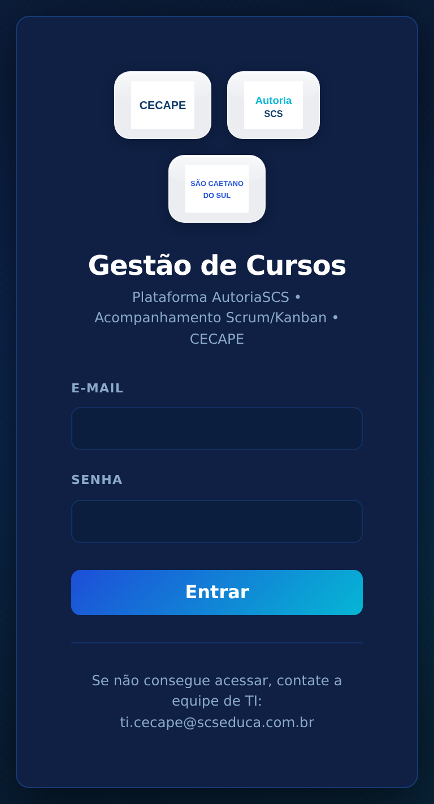

**Campos desta tela:**

- **E-mail** — digite o seu e-mail institucional completo (ex.: `seunome@scseduca.com.br`);
- **Senha** — digite a senha que a equipe de TI lhe entregou. Atenção: o sistema
  diferencia letras maiúsculas de minúsculas;
- Botão **Entrar** — clique nele depois de preencher os dois campos.

**Se der errado:** aparece a mensagem *"E-mail ou senha inválidos"*. Confira se
digitou tudo certo e tente de novo. Se esqueceu a senha, escreva para
ti.cecape@scseduca.com.br pedindo a redefinição.

**Bom saber:** você fica conectado por 8 horas. Cada clique renova esse prazo,
então o sistema não desconecta no meio do trabalho.

## 2. Conhecendo a tela principal (Dashboard)

Depois de entrar, você cai no **Dashboard** — a sua página inicial. No topo há a
barra de menus:

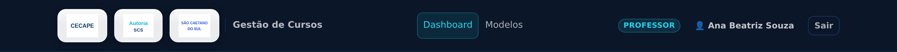

**Da esquerda para a direita:**

- **Dashboard** — volta para esta página inicial;
- **Modelos** — biblioteca com os templates oficiais para você baixar (slides, estrutura de curso etc.);
- **Etiqueta amarela** — mostra o seu perfil (PROFESSOR);
- **👤 Seu nome** — clique para abrir o **Meu Perfil** (troca de senha e preferências de e-mail);
- **Sair** — clique ao terminar de usar o sistema.

No meio da página fica a lista com **os seus cursos** (você só vê os seus — os
cursos de outros formadores não aparecem):

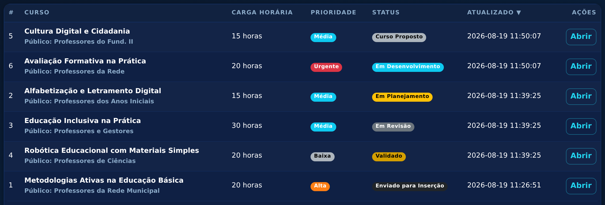

**O que cada coluna mostra:** o nome do curso, o status atual (a fase), a
prioridade, os prazos e o botão **Abrir**, que leva para a página completa do curso.

## 3. Propor um curso novo

### Passo 1 — clique no botão verde

No Dashboard, clique em:

### Passo 2 — preencha o formulário

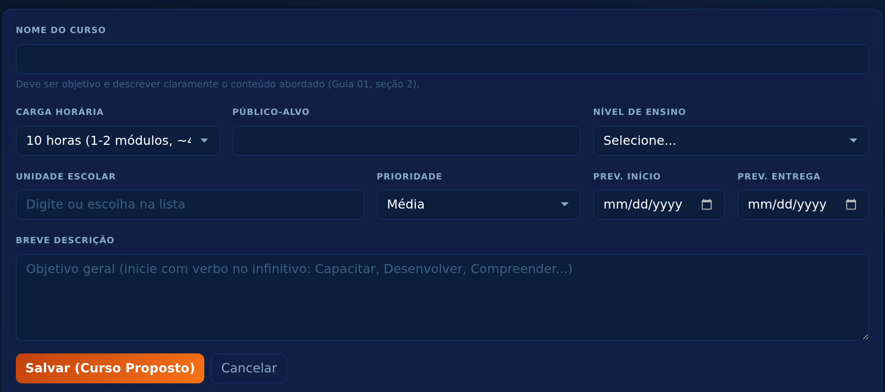

**Cada campo explicado:**

| Campo | Como preencher | Obrigatório? |
|---|---|---|
| **Nome do curso** | Escreva um nome objetivo, que descreva o conteúdo (Guia 01, seção 2) | Sim |
| **Carga horária** | Lista suspensa. Escolha 10, 20, 30 ou 40 horas — a própria lista mostra quantos módulos e minutos de vídeo correspondem a cada opção | Sim |
| **Público-alvo** | Para quem é o curso (ex.: "Professores dos Anos Iniciais") | Sim |
| **Nível de ensino** | Lista suspensa com os níveis (Educação Infantil, Fundamental...) | Não |
| **Unidade escolar** | Comece a digitar e o sistema mostra a lista das escolas cadastradas — clique na sua. Também aceita digitação livre | Não |
| **Prioridade** | Lista suspensa: Baixa, Média, Alta ou Urgente. Na dúvida, deixe **Média** | Não |
| **Prev. início / Prev. entrega** | Clique no campo e escolha as datas no calendário que abre | Não |
| **Breve descrição** | Escreva o objetivo geral começando com verbo no infinitivo: "Capacitar...", "Desenvolver..." | Não |

### Passo 3 — salvar

Clique no botão verde **Salvar**. Uma janelinha pergunta *"Confirmar a proposta do
novo curso?"* — clique em **Sim, propor**. Pronto: o curso é criado com o status
**Curso Proposto** e a equipe do CECAPE recebe um e-mail avisando.

## 4. A página do curso

Clique em **Abrir** ao lado de qualquer curso seu. Esta página concentra tudo:
dados, mudança de status, checklist, arquivos, links e histórico. Vamos por partes.

### 4.1 Backlog do Curso (canto superior esquerdo)

Mostra os dados preenchidos na proposta. Para corrigir algo, clique no botão
**Editar** no topo da página, altere e salve.

### 4.2 Ações de Status — mover o curso de fase

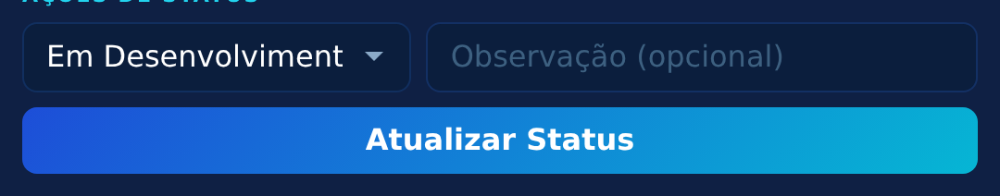

**Como funciona:** o retângulo com a setinha é uma lista suspensa que mostra
**apenas as fases para as quais você pode mover o curso agora**. O sistema cuida da
ordem — você nunca verá uma opção errada.

**Para mover:**

1. Clique na lista e escolha a próxima fase;
2. Se quiser, escreva uma observação no campo ao lado (opcional);
3. Clique em **Atualizar Status** e confirme na janelinha.

**As suas fases, na ordem normal do trabalho:**

1. **Curso Proposto → Em Planejamento** — você começou a planejar;
2. **Em Planejamento → Em Desenvolvimento** — você começou a produzir o material;
3. **Em Desenvolvimento → Pronto para Análise** — terminou! O CECAPE recebe um
   e-mail e inicia a revisão. *Antes de mover para cá, envie todos os materiais
   (seção 6 deste guia).*

**Se o curso for recusado na revisão:**

4. **Recusado - Ajustes Necessários → Em Ajuste** — você começou a corrigir;
5. **Em Ajuste → Pronto para Nova Análise** — correções concluídas, volta para o CECAPE.

**Na fase final (depois que a MB insere o curso na plataforma):**

6. **Inserido → Aguardando Validação** — você está conferindo o curso montado na plataforma;
7. **Aguardando Validação → Validado** — está tudo certo! A TI então agenda a publicação.

A cada movimentação, quem precisa agir na próxima etapa é avisado por e-mail
automaticamente — você não precisa avisar ninguém.

### 4.3 Checklist — seu controle de produção

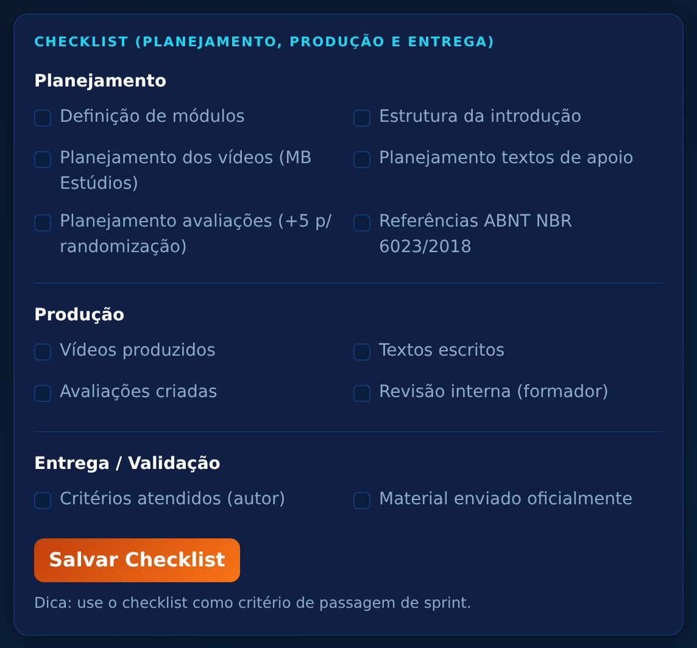

São caixinhas de marcação divididas em **Planejamento**, **Produção** e
**Entrega/Validação**. Clique na caixinha quando concluir o item (ex.: "Vídeos
produzidos") e depois clique em **Salvar Checklist**. Use como guia do que ainda
falta — a equipe também enxerga esse checklist.

## 5. Apontamentos — quando o CECAPE pede ajustes

Se a revisão encontrar algo a corrigir, o curso volta com o status **Recusado -
Ajustes Necessários** e você recebe um e-mail. Na página do curso, o quadro
**Apontamentos** lista cada item a ajustar, com o tipo (Técnico, Pedagógico, ABNT):

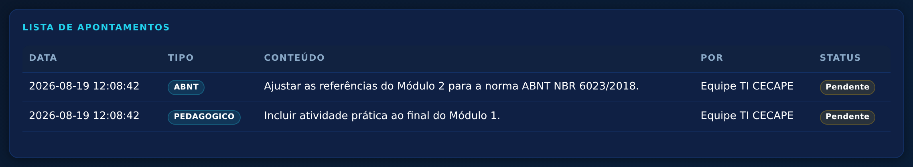

**O que fazer:** corrija o material, marque cada apontamento como **Resolvido**
(botão ao lado do item, na tela Apontamentos) e mova o curso:
**Em Ajuste → Pronto para Nova Análise**.

## 6. Enviar os materiais do curso — a parte mais importante

Os arquivos são enviados na seção **Arquivos do Curso**, na página do curso.
O sistema organiza o envio em uma **ordem fixa** — é a ordem em que a MB Estúdios
monta o curso na plataforma. Você não precisa decorar nada: o próprio sistema
mostra e libera uma etapa por vez.

### 6.1 O formulário de envio

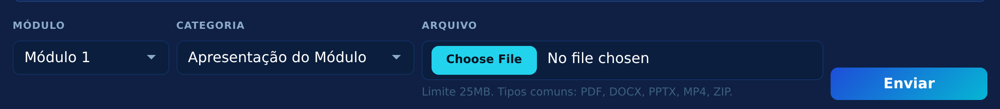

**Preencha sempre nesta sequência:**

1. **Módulo** (lista suspensa) — escolha **Geral** (materiais do curso inteiro) ou
   **Módulo 1** a **Módulo 8** (materiais daquele módulo);
2. **Categoria** (lista suspensa) — mostra todas as etapas do módulo escolhido,
   mas **somente a próxima da sequência pode ser escolhida** — as demais aparecem
   acinzentadas (bloqueadas) até chegar a vez delas. As já enviadas ficam com
   "✓ enviado" e continuam disponíveis caso você precise mandar um arquivo a mais;
3. **Arquivo** — clique em **Escolher arquivo**, localize o documento no seu
   computador e selecione. Limite: 25MB. Tipos comuns: PDF, DOCX, PPTX, MP4, ZIP;
4. Clique em **Enviar**.

### 6.2 O painel "Ordem de entrega"

Assim que você escolhe o módulo, aparece um painel mostrando a situação de cada etapa:

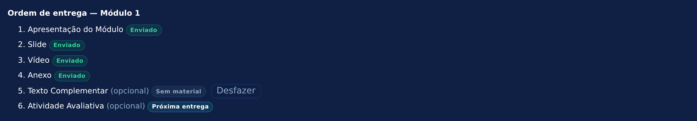

**Legenda dos aviso coloridos:**

- **Enviado** (verde) — etapa concluída;
- **Primeira entrega / Próxima entrega** (azul claro) — é a etapa da vez;
- **Aguardando anteriores** (escuro) — ainda bloqueada;
- **Sem material** (cinza) — você declarou que não possui esse material (veja 6.4).

### 6.3 As sequências de cada módulo

**Módulo Geral** (documentos do curso como um todo):

1. Apresentação do(s) Formador(es)
2. Apresentação do Curso
3. Objetivos
4. Atividade Avaliativa Geral *(opcional)*
5. Referência Bibliográfica

**Módulos 1 a 8** (cada módulo tem a sua própria sequência, independente):

1. Apresentação do Módulo
2. Slide
3. Vídeo
4. Anexo
5. Texto Complementar *(opcional)*
6. Atividade Avaliativa *(opcional)*

### 6.4 "Não possuo este material" — as etapas opcionais

Quando a etapa da vez é **opcional** (Texto Complementar, Atividade Avaliativa ou
Atividade Avaliativa Geral) e você não produziu esse material, aparece uma caixinha
abaixo do formulário:

Marque a caixinha e clique no botão (que muda para **Registrar sem material**).
Confirme na janelinha. O sistema registra a declaração e libera a etapa seguinte.
Se depois você criar o material, clique em **Desfazer** no painel de ordem — a
etapa volta a aceitar envio.

**Importante:** as etapas obrigatórias não têm essa caixinha — o arquivo precisa
ser enviado.

### 6.5 Arquivos grandes (vídeos brutos, materiais acima de 25MB)

Use a seção **Links Externos**, logo abaixo dos arquivos:

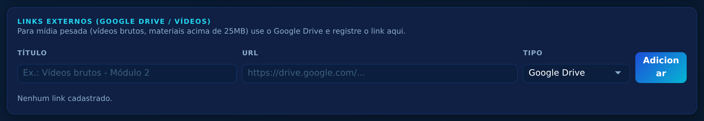

1. Coloque o material no seu Google Drive e copie o link de compartilhamento;
2. No campo **Título**, descreva o material (ex.: "Vídeos brutos - Módulo 2");
3. Cole o link no campo **URL**;
4. Escolha o **Tipo** (Google Drive, Vídeo ou Outro) e clique em **Adicionar**.

## 7. Biblioteca de Modelos

No menu **Modelos** ficam os templates oficiais (modelo de slides, estrutura de
curso, guia, minibiografia...). Os marcados com **★ vigente** são as versões
atuais que você deve usar. Clique em **Baixar** para salvar no seu computador:

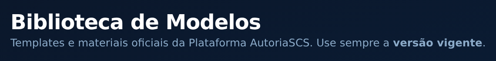

## 8. Meu Perfil — senha e e-mails

Clique no **👤 seu nome** no topo da tela.

**Notificações por e-mail** — escolha como quer ser avisado(a):

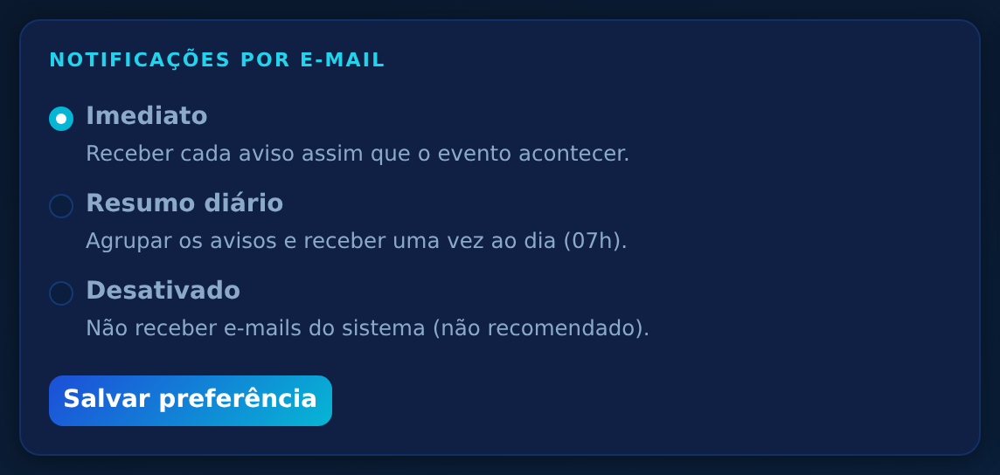

- **Imediato** — recebe o e-mail na hora de cada acontecimento (recomendado);
- **Resumo diário** — recebe um apanhado por dia;
- **Desativado** — não recebe e-mails.

**Alterar minha senha** — digite a senha atual, a nova senha duas vezes e clique
em salvar:

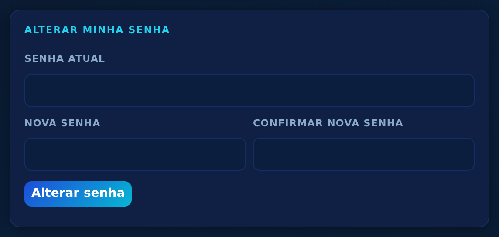

## 9. Perguntas frequentes

**Enviei um arquivo errado. E agora?**
Envie o arquivo certo na mesma categoria (ela continua aceitando envios) e escreva
para ti.cecape@scseduca.com.br pedindo a exclusão do errado — somente a
administração pode excluir arquivos.

**A categoria que preciso está bloqueada (acinzentada).**
É porque alguma etapa anterior daquele módulo ainda não foi concluída. Olhe o
painel **Ordem de entrega**: a etapa marcada em azul é a que falta.

**Não aparece a opção de mover o status.**
Cada perfil só move nas fases que lhe cabem. Se o curso está "Em Revisão", por
exemplo, a bola está com o CECAPE — você não tem ação a fazer.

**O sistema me desconectou.**
A sessão dura 8 horas renovada a cada clique. Entre novamente com e-mail e senha.
