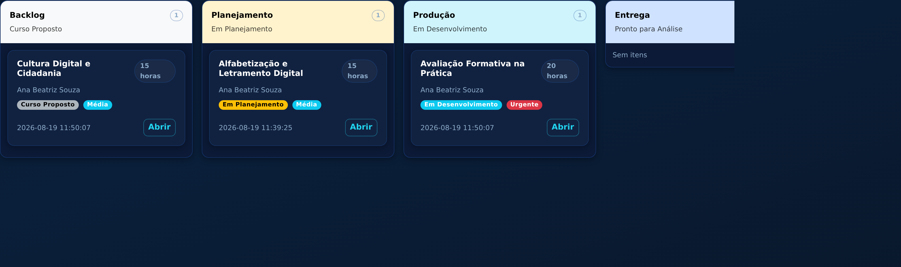
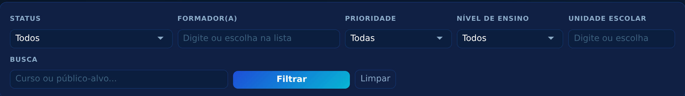
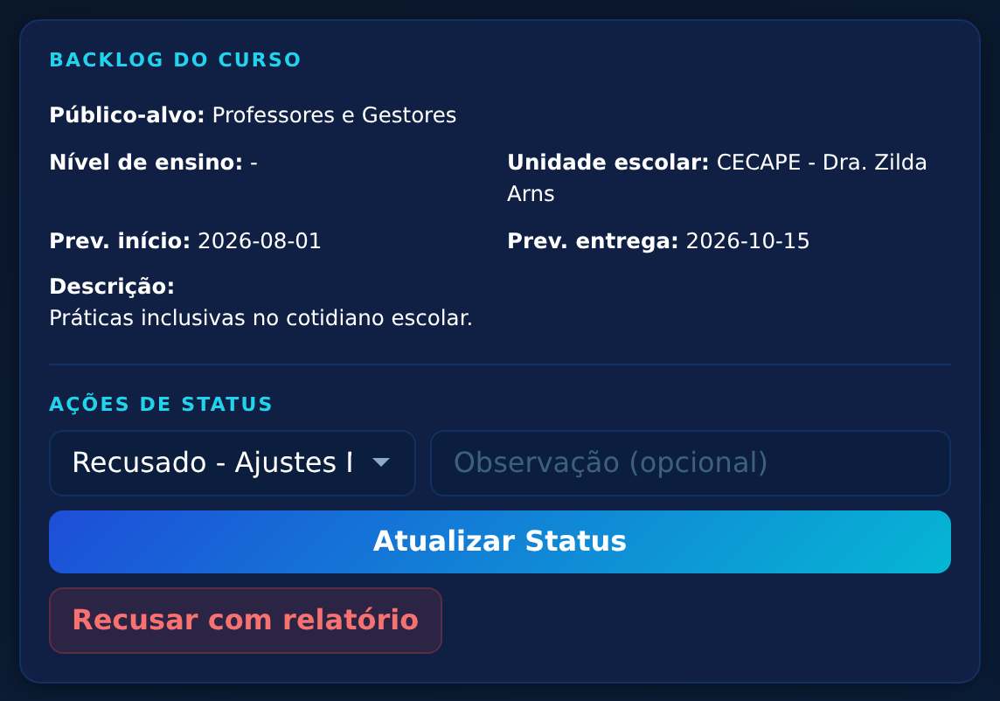
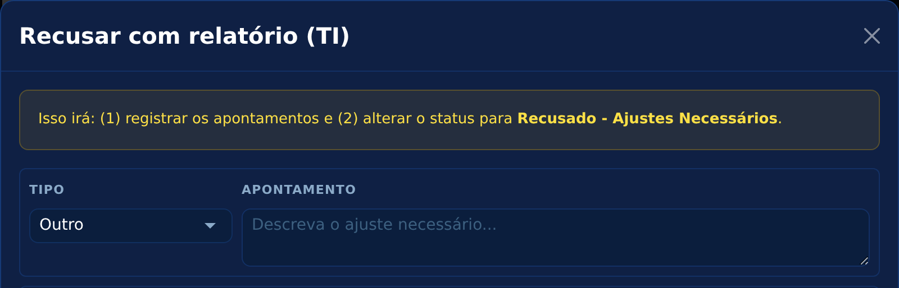
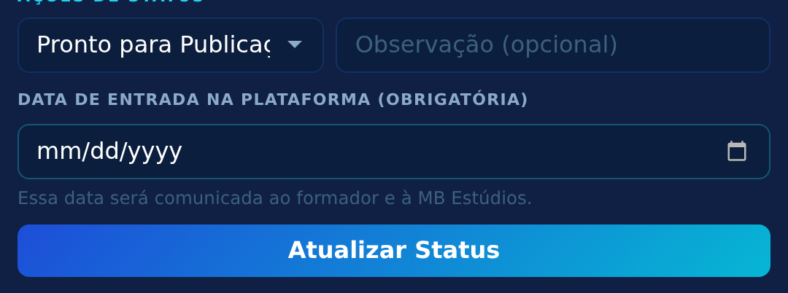
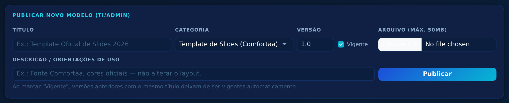

# Tutorial Completo — Equipe TI (Revisão CECAPE)

**Sistema AutoriaSCS • Gestão de Cursos** — guia passo a passo da equipe de revisão,
escrito para quem está começando no sistema.

> **Endereço:** `https://cecapescs.com.br/autoriascs/scrum/`
> **Suporte:** ti.cecape@scseduca.com.br

---

## 1. Entrar no sistema

Abra o navegador, acesse o endereço acima, digite **e-mail** e **senha** e clique em
**Entrar** (tela igual à dos formadores — veja o tutorial do professor, seção 1, se
precisar do passo a passo do login).

## 2. O quadro Kanban — sua visão geral

Diferente do formador (que só vê os próprios cursos em lista), a equipe TI enxerga
**todos os cursos de todos os formadores**, organizados num quadro de colunas — o
**Kanban**. Cada coluna é uma etapa do fluxo; cada cartão é um curso:

**Como ler o quadro:** o curso "anda" da esquerda (Backlog) para a direita
(Publicado). O número no topo de cada coluna conta quantos cursos estão nela.
Em cada cartão: nome do curso, formador(a), carga horária, status, prioridade e o
botão **Abrir**.

**Duas formas de mover um curso:**

- **Arrastar o cartão** com o mouse para a coluna seguinte (segure o botão do mouse
  sobre o cartão, leve até a coluna e solte). O sistema só aceita se a movimentação
  for permitida ao seu perfil;
- **Abrir o curso** e usar **Ações de Status** (mais completo — permite observação).

**Alternar visualização:** os botões **Kanban** / **Tabela** no topo trocam entre o
quadro e uma lista corrida.

### 2.1 Filtros

Acima do quadro há a barra de filtros:

| Filtro | Como usar |
|---|---|
| **Status** | Lista suspensa com todas as fases |
| **Formador(a)** | Comece a digitar: o sistema sugere os nomes cadastrados — clique num deles ou continue digitando |
| **Prioridade** | Baixa, Média, Alta, Urgente |
| **Nível de ensino** | Lista suspensa |
| **Unidade escolar** | Igual ao formador: digite ou escolha na lista |
| **Busca** | Procura por trecho do nome do curso ou público-alvo |

Clique em **Filtrar** para aplicar e em **Limpar** para remover tudo.

## 3. Revisar um curso — o coração do trabalho da TI

### Passo 1 — assumir a revisão

Quando um formador move o curso para **Pronto para Análise**, o e-mail
institucional (ti.cecape@scseduca.com.br) recebe um aviso. Abra o curso e, em
**Ações de Status**, mova para **Em Revisão** — isso sinaliza que a análise começou.

### Passo 2 — analisar o material

Na página do curso você encontra tudo o que precisa:

- **Backlog do Curso** — os dados da proposta;
- **Checklist** — o que o formador declarou como concluído;
- **Arquivos do Curso** — os materiais, listados **na ordem oficial de entrega**
  (módulo Geral primeiro, depois Módulo 1, 2...; dentro de cada módulo, na
  sequência das categorias). O botão **Baixar todos (ZIP)** baixa o pacote completo
  já organizado em pastas numeradas;
- **Links Externos** — vídeos brutos e materiais pesados no Google Drive.

### Passo 3 — decidir

**Se estiver tudo certo:** mova **Em Revisão → Aprovado**. O formador recebe o
e-mail de aprovação.

**Se precisar de ajustes:** clique no botão vermelho **Recusar com relatório**.
Abre esta janela:

**Como preencher o relatório:**

1. Em cada linha, escolha o **Tipo** na lista suspensa:
   - **Técnico** — problema de arquivo, formato, qualidade de vídeo/áudio;
   - **Pedagógico** — conteúdo, didática, objetivos;
   - **ABNT** — referências fora da norma NBR 6023/2018;
   - **Outro** — o que não se encaixa acima;
2. Escreva o ajuste necessário no campo **Apontamento** (seja específico:
   *"Slide 12 do Módulo 3: corrigir o ano da referência"*);
3. Linhas em branco são ignoradas — preencha só as que precisar (até 5 por vez);
4. Clique em **Confirmar Recusa**.

Numa única operação o sistema: registra os apontamentos, muda o status para
**Recusado - Ajustes Necessários** e envia ao formador um e-mail com a lista
completa.

**Acompanhamento:** a tela **Apontamentos** (botão no topo da página do curso)
mostra cada item como Pendente ou Resolvido. Você também pode registrar
apontamentos avulsos por lá a qualquer momento.

### Passo 4 — reanálise

Quando o formador devolve (**Pronto para Nova Análise**), repita o ciclo:
mova para **Em Revisão** e decida de novo.

## 4. Encaminhar para a MB Estúdios

Curso aprovado? Mova **Aprovado → Enviado para Inserção**. A MB recebe o aviso por
e-mail e assume: baixa o pacote ZIP e insere o conteúdo na plataforma. Durante a
inserção você acompanha pelo Kanban (colunas da MB), sem precisar agir.

## 5. Agendar a publicação — a data é obrigatória

Depois da inserção, o formador confere o curso na plataforma e marca **Validado**.
Aí entra a última ação da TI:

1. Abra o curso e, em **Ações de Status**, escolha **Pronto para Publicação**;
2. Aparece o campo **Data de entrada na plataforma (obrigatória)** — clique nele e
   escolha a data no calendário:

3. Clique em **Atualizar Status** e confirme.

O formador e a MB recebem e-mail com a data. A MB então publica e marca
**Publicado** — fim do fluxo. 🎉

## 6. Resumo das suas movimentações

| De | Para | Quando |
|---|---|---|
| Pronto para Análise | Em Revisão | Ao iniciar a análise |
| Pronto para Nova Análise | Em Revisão | Ao iniciar a reanálise |
| Em Revisão | Aprovado | Material aprovado |
| Em Revisão | Recusado - Ajustes Necessários | Pelo botão "Recusar com relatório" |
| Aprovado | Enviado para Inserção | Encaminhar à MB |
| Validado | Pronto para Publicação | Com a data de publicação |

## 7. Biblioteca de Modelos — publicar templates

Menu **Modelos** → quadro **Publicar novo modelo**:

| Campo | Como preencher |
|---|---|
| **Título** | Nome do template (ex.: "Modelo de Slides 2026") |
| **Categoria** | Template de Slides, Estrutura de Curso, Guia, Minibio, Avaliação ou Outros |
| **Versão** | Ex.: 1.0, 2.1 — para os formadores saberem qual é a mais nova |
| **Arquivo** | O documento em si (até 50MB) |
| **Descrição** | Orientações de uso |

Na lista, o botão **★/☆** marca qual versão é a **vigente** (a que os formadores
devem usar); **Desativar** esconde o modelo sem apagar; **Excluir** remove de vez.

## 8. Relatórios

Menu **Relatórios**: cursos por status, produção por formador(a) e a lista de
cursos com prazo estourado ou próximo. Tabelas exportáveis em CSV (abre no Excel).

## 9. E-mails automáticos que a TI recebe

- Qualquer mudança de status feita por **formador** ou pela **MB** → aviso para
  ti.cecape@scseduca.com.br;
- Curso **Inserido** → aviso para iniciar a validação;
- Alertas diários de prazos (7h) e resumo semanal às segundas-feiras.
